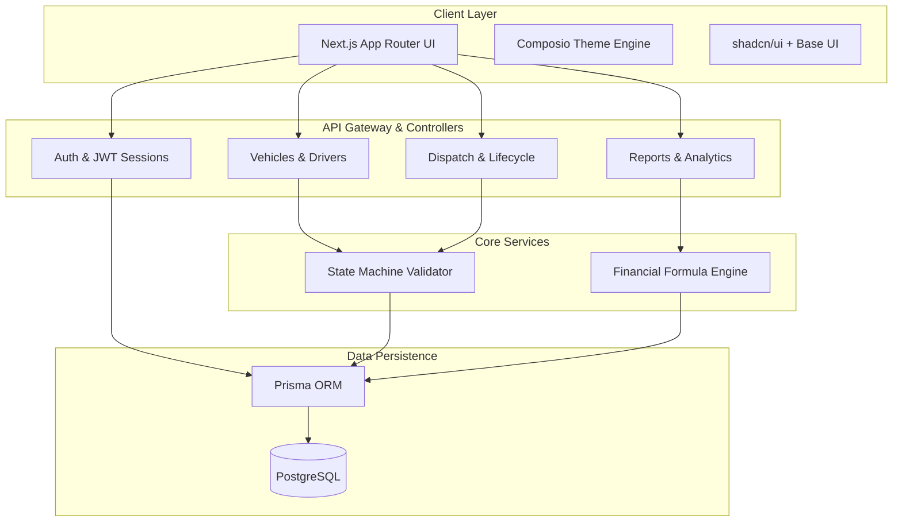
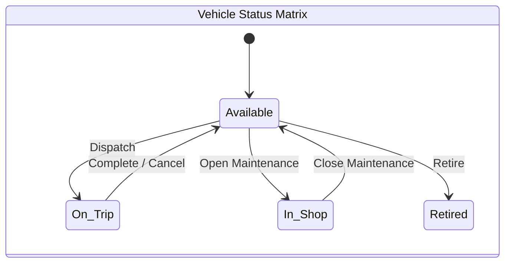
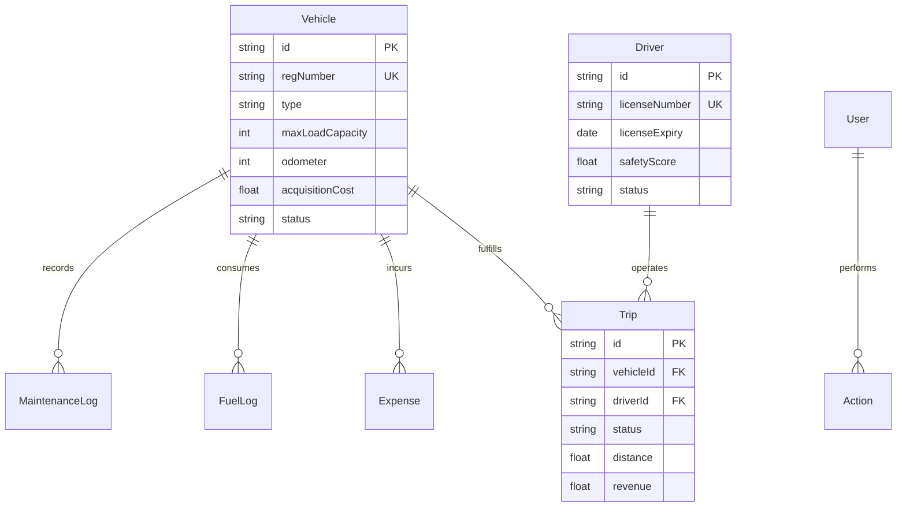
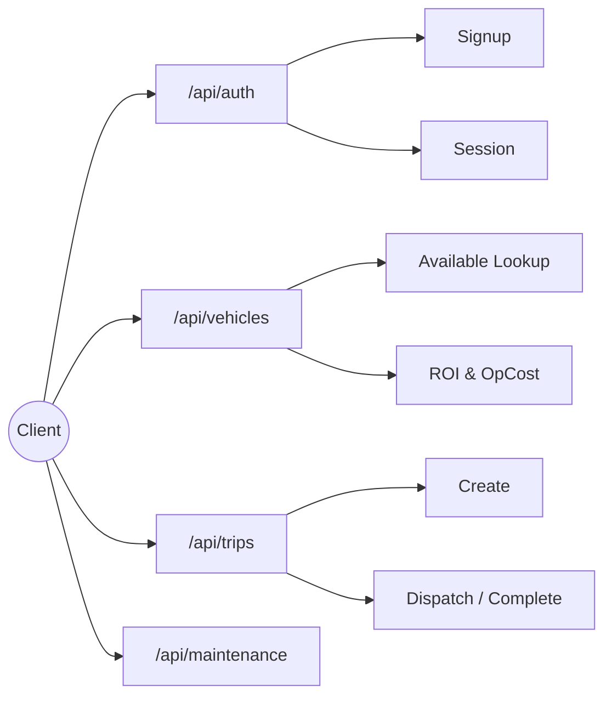

<div align="center">

# TransitOps

**Enterprise Fleet Operations Intelligence Platform**

<br />

A full-stack fleet management system built for real-time vehicle tracking,<br />
trip lifecycle orchestration, financial analytics, and operational intelligence.

<br />

[](https://nextjs.org)
[](https://www.typescriptlang.org)
[](https://www.prisma.io)
[](https://www.postgresql.org)
[](https://tailwindcss.com)
[](https://recharts.org)
[](https://vitest.dev)
[](https://docs.docker.com/compose/)

<br />


</div>

<br />

---

<br />

## Visual Tour

### Dashboard Overview


### Real-time Dispatch Map


### Secure Role-Based Authentication


<br />

---

<br />

## 1. Architectural Overview

TransitOps is a modular, production-grade fleet management platform designed to handle the full operational lifecycle of a transport company — from vehicle acquisition and driver management, through trip dispatch and execution, to financial reporting and ROI analysis. 

The system leverages a **state-machine-driven core** where vehicles and drivers transition through well-defined statuses with validated guard clauses, ensuring strict data integrity across the platform.

### High-Level System Design



<br />

---

<br />

## 2. Technology Stack

Our infrastructure leverages modern, strictly-typed technologies to ensure high availability, scalable data access, and rapid feature iteration.

| Layer | Technology | Purpose |
|:------|:-----------|:--------|
| **Framework** |  | Server/client rendering, file-based routing and middleware |
| **Language** |  | End-to-end type safety and compilation verification |
| **Database** |  | ACID-compliant relational data store |
| **ORM** |  | Schema-first data access with declarative migrations |
| **Styling** |  | Utility-first CSS with HSL token architecture |
| **Visualizations**|  | Dynamic, accessible, and responsive data charts |
| **Authentication**|  | Secure password hashing, stateless HttpOnly token auth |
| **Testing** |  | Unit tests for business logic & financial formulas |
| **Infrastructure**|  | Declarative environment provisioning |

<br />

---

<br />

## 3. Core Modules

<br />

### 

- Robust sign-up workflows with input sanitization and validation.
- Cryptographic password hashing utilizing **bcrypt** (12 salt rounds).
- Stateless **JWT** authentication passing via secure HttpOnly cookies.
- Comprehensive Role-Based Access Control (RBAC) foundation.

<br />

### 

- **KPI Grid**: Real-time multi-dimensional view of active vehicles, dispatch volume, and fleet utilization.
- **Dynamic Filtering**: Complex multi-parameter filtering (by status, region, type) synchronized seamlessly with URL state.
- **Utilization Visualizations**: Immersive Recharts Area charts augmented with gradient fills and theme-aware tooltips.
- **Progressive Enhancement**: Skeleton loaders that perfectly mirror final DOM structures for layout-shift-free loading.

<br />

### 

The core operational logic runs on strict transition engines to prevent invalid states.



<br />

### 

- **Fuel Efficiency Algorithms**: Computational analysis of `distanceKm / totalLiters` across the fleet.
- **Operational Cost Aggregation**: Unifying fuel logs, maintenance overhead, and variable expenses per time period.
- **ROI Engine**: Real-time evaluation of `((Revenue - OperationalCost) / AcquisitionCost) * 100`.
- **Client-Side Export**: Integrated CSV generation algorithms across all data tables for deep offline analysis.

<br />

---

<br />

## 4. Entity-Relationship Architecture

The normalized PostgreSQL schema provides high query performance and referential integrity across 6 distinct but deeply connected domain models.



<br />

---

<br />

## 5. API Topography



<br />

---

<br />

## 6. Installation & Deployment

### Dependencies
| Requirement | Minimum Version |
|:------------|:----------------|
|  | LTS recommended |
|  | Required for local Database |

### Startup Sequence

```bash
# 1. Clone the repository and install packages
git clone https://github.com/asta-maxx/OneReign_1.git
cd OneReign_1
npm install

# 2. Spin up the relational database
docker compose up -d

# 3. Apply schema and generate types
npx prisma migrate dev
npx prisma generate

# 4. (Optional) Hydrate database with mock data
npm run db:seed

# 5. Launch the application
npm run dev
```

Visit the application at **http://localhost:3000**.

<br />

---

<br />

## 7. Demo Accounts

All demo accounts share the password: `password1234`
- `fleet@transitops.local` (Fleet Manager)
- `driver@transitops.local` (Driver)
- `safety@transitops.local` (Safety Officer)
- `finance@transitops.local` (Financial Analyst)

<br />

---

<br />

## 8. UI / UX Design System

The application strictly adheres to a **minimalist, ops-intelligence aesthetic** (heavily inspired by developer infrastructure platforms like Vercel, Linear, and Stripe).

- **Multi-Theme Support**: Flawless transitions between pure black (`#0f0f0f`) dark modes and crisp white light modes using a centralized `ThemeProvider`.
- **CSS Variable Architecture**: All tokens are strictly defined in HSL, completely avoiding hardcoded HEX values to ensure infinite scalability.
- **Data Display**: Tabular numbers for financial integrity, subtle elevations for interactive surfaces, and Recharts optimized with custom CSS vars.

<br />

---

<br />

## 9. Security & Compliance (SOC 1/2 & GDPR)

TransitOps is engineered with security and data privacy by design to streamline compliance audits for SOC 1, SOC 2, and GDPR requirements.

- **SOC 2 (Security & Confidentiality)**: Enforces stateless authentication using **HttpOnly JWTs** and robust **bcrypt password hashing** (12 salt rounds). Eliminates Cross-Site Scripting (XSS) risks related to session tokens. Comprehensive Role-Based Access Control (RBAC) satisfies logical access control requirements.
- **SOC 1 (Data Integrity)**: The state-machine-driven dispatch architecture guarantees valid transitions, producing immutable operational records essential for transparent financial reporting (ROI & Expense metrics).
- **GDPR (Data Privacy)**: Incorporates strict data minimization principles by design. TLS/HTTPS enforcement for in-transit data and bcrypt for at-rest password data satisfy Article 32 (Security of Processing). 

> For detailed technical mappings, see the `SOC_GDPR_COMPLIANCE.md` artifact included in the source code.

<br />

---

<br />

<div align="center">
  <br />
  <strong>Built by OneReign</strong>
  <br />
  <br />
  
</div>
