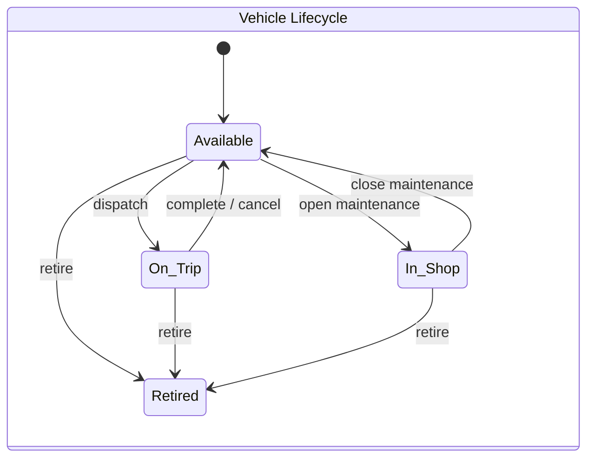
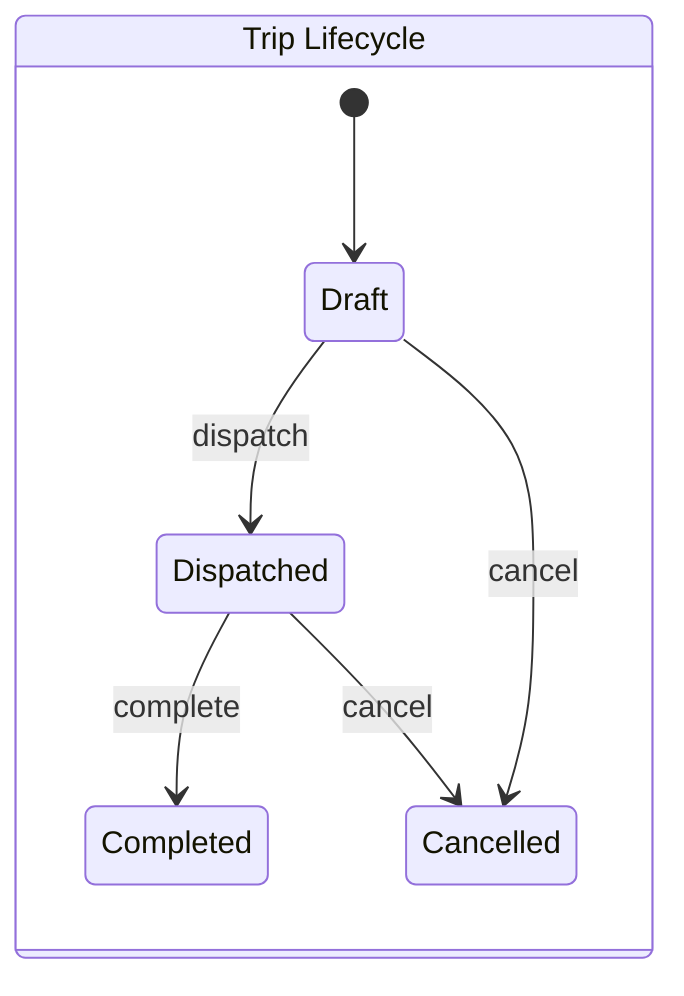
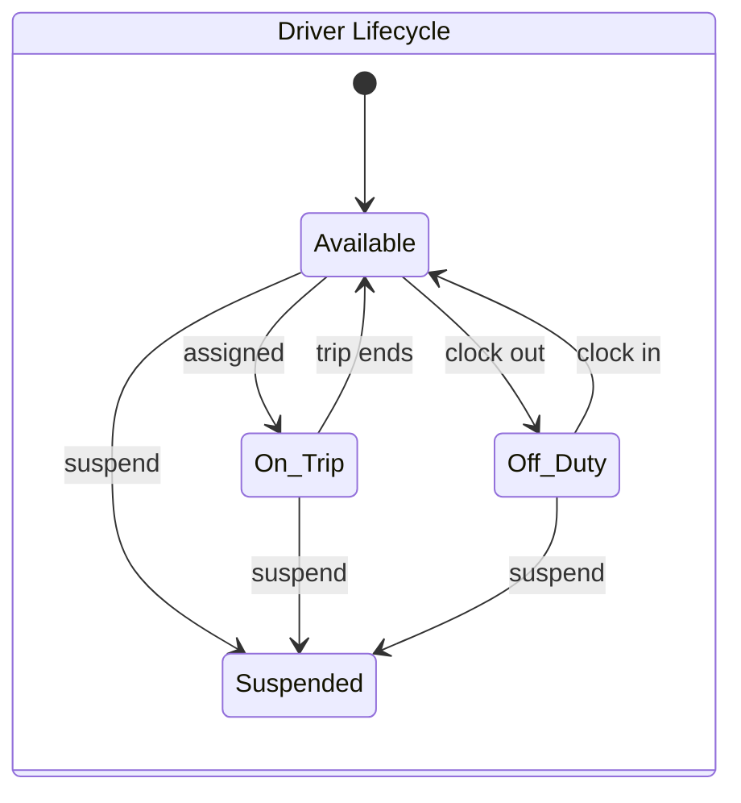
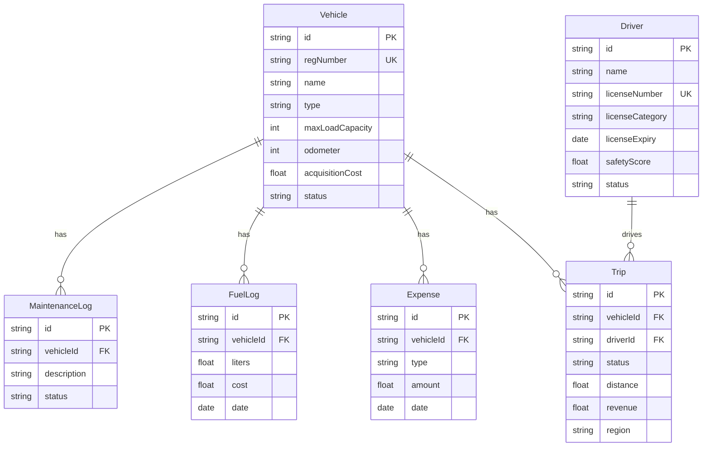
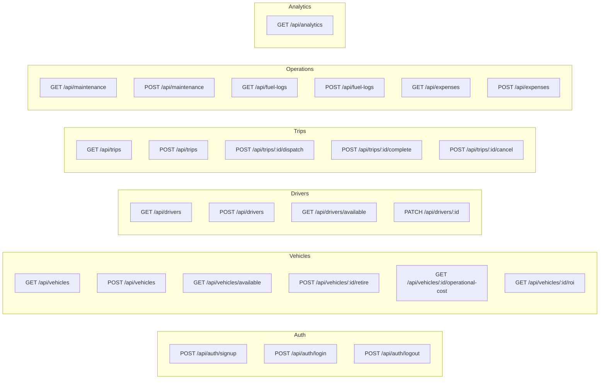

<div align="center">

# TransitOps

**Enterprise Fleet Operations Intelligence Platform**

<br />

A full-stack fleet management system built for real-time vehicle tracking,<br />
trip lifecycle orchestration, financial analytics, and operational intelligence.

<br />

[](https://nextjs.org)
[](https://www.typescriptlang.org)
[](https://www.prisma.io)
[](https://www.postgresql.org)
[](https://tailwindcss.com)
[](https://recharts.org)
[](https://vitest.dev)
[](https://docs.docker.com/compose/)

<br />


</div>

<br />

---

<br />

## Overview

TransitOps is a modular, production-grade fleet management platform designed to handle the full operational lifecycle of a transport company — from vehicle acquisition and driver management, through trip dispatch and execution, to financial reporting and ROI analysis.

The system is architected around a **state-machine-driven core** where vehicles and drivers transition through well-defined statuses with validated guard clauses, ensuring data integrity across every operation.

<br />

---

<br />

## Architecture

```
┌─────────────────────────────────────────────────────────────────────┐
│                        Frontend (Next.js App Router)                │
│  ┌──────────┐  ┌────────────┐  ┌───────────┐  ┌──────────────────┐ │
│  │ Dashboard │  │ Reports &  │  │Maintenance│  │  Fuel Logs &     │ │
│  │   KPIs    │  │ Analytics  │  │  Module   │  │   Expenses       │ │
│  └─────┬─────┘  └─────┬──────┘  └─────┬─────┘  └───────┬──────────┘ │
│        └───────────────┴───────────────┴────────────────┘            │
│                          ↓ API Client Layer (lib/api/*)              │
├─────────────────────────────────────────────────────────────────────┤
│                        Backend (API Routes)                         │
│  ┌──────────┐  ┌────────────┐  ┌───────────┐  ┌──────────────────┐ │
│  │  Auth     │  │  Vehicles  │  │   Trips   │  │  Analytics &     │ │
│  │  (JWT)    │  │  & Drivers │  │ Lifecycle │  │  Cost Engine     │ │
│  └─────┬─────┘  └─────┬──────┘  └─────┬─────┘  └───────┬──────────┘ │
│        └───────────────┴───────────────┴────────────────┘            │
│                     ↓ Status Transition Engine                      │
├─────────────────────────────────────────────────────────────────────┤
│                    Data Layer (Prisma ORM + PostgreSQL)              │
│  Vehicle ←→ Trip ←→ Driver    MaintenanceLog   FuelLog   Expense   │
└─────────────────────────────────────────────────────────────────────┘
```

### State Machines







<br />

---

<br />

## Tech Stack

| Layer | Technology | Purpose |
|:------|:-----------|:--------|
| **Framework** |  | Server/client rendering, file-based routing |
| **Language** |  | End-to-end type safety |
| **Database** |  | Relational data store (self-hosted via Docker) |
| **ORM** |  | Schema-first data access with migrations |
| **Styling** |  | Design system with HSL token architecture |
| **Charts** |  | Custom-styled data visualizations |
| **Auth** |  | Password hashing, stateless token auth |
| **Testing** |  | Unit tests for business logic & formulas |
| **Infra** |  | One-command local PostgreSQL provisioning |

<br />

---

<br />

## Modules

<br />

### 

- Signup with input validation (email format, password strength, name length)
- bcrypt password hashing (12 salt rounds)
- JWT token generation with HttpOnly cookie transport
- Foundation for login/logout session lifecycle

<br />

### 

- **KPI Grid** — Real-time fleet overview: Active Vehicles, Available, In Maintenance, Active Trips, Pending Trips, Drivers On Duty, Fleet Utilization %
- **Filter Bar** — Dynamic filtering by status, region, vehicle type with URL state sync
- **Utilization Chart** — Recharts Area chart with gradient fill, custom dark-theme tooltips
- **Skeleton Loaders** — Layout-matching loading states (no spinners)

<br />

### 

| Report | Visualization | Key Metric |
|:-------|:-------------|:-----------|
| **Fuel Efficiency** | Bar chart + sortable table | km/l per vehicle with color-coded thresholds |
| **Fleet Utilization** | Line chart + data table | Active vs. idle days with red-flagging |
| **Operational Cost** | Stacked bar (Fuel vs. Maintenance) | Total cost per vehicle |
| **ROI Analysis** | Color-coded data table | Per-vehicle return on investment % |

> All reports include **client-side CSV export** — one-click download of the currently filtered dataset.

<br />

### 

- Create, track, and close maintenance logs per vehicle
- Vehicle status automatically transitions to `In Shop` on active maintenance
- Closing a maintenance record restores vehicle to `Available`

<br />

### 

- Log fuel fill-ups with volume (liters), cost, and date
- Per-vehicle fuel history tracking
- Data feeds into the Fuel Efficiency report

<br />

### 

- Categorized expenses: Toll, Maintenance, Other
- Per-vehicle expense aggregation
- Data feeds into the Operational Cost and ROI reports

<br />

### 

- Full CRUD for vehicles and drivers
- **State Machine Engine** (`lib/statusTransitions.ts`) — validates every status transition:
  - Vehicle: `Available` → `On Trip` → `Available`, `Available` → `In Shop` → `Available`, `*` → `Retired`
  - Driver: `Available` → `On Trip` → `Available`, `Available` → `Off Duty` → `Available`, `*` → `Suspended`
- Atomic trip lifecycle: `Draft` → `Dispatched` → `Completed` | `Cancelled`

<br />

### 

- **Fuel Efficiency** — `distanceKm / totalLiters` per vehicle
- **Operational Cost** — aggregated fuel + maintenance + expenses per vehicle per period
- **ROI** — `(Revenue - OperationalCost) / AcquisitionCost x 100`
- All formulas are unit-tested with Vitest (`lib/calc.test.ts`)

<br />

---

<br />

## Data Model



> **6 models** · All relationships indexed · Status fields use plain strings (not enums) for flexibility with space-containing values like `"On Trip"` and `"In Shop"`.

<br />

---

<br />

## API Surface



<br />

---

<br />

## Getting Started

### Prerequisites

| Requirement | Version |
|:------------|:--------|
|  | LTS recommended |
|  | For PostgreSQL |

### Setup

```bash
# 1. Clone the repository
git clone https://github.com/asta-maxx/OneReign_1.git
cd OneReign_1

# 2. Install dependencies
npm install

# 3. Start PostgreSQL
docker compose up -d

# 4. Configure environment
cp .env.example .env

# 5. Run database migrations & generate client
npx prisma migrate dev
npx prisma generate

# 6. Seed the database (optional)
npm run db:seed

# 7. Start the development server
npm run dev
```

Open **http://localhost:3000** to view the application.

### Available Scripts

| Command | Description |
|:--------|:------------|
| `npm run dev` | Start development server with hot reload |
| `npm run build` | Create production build |
| `npm run test` | Run unit tests (Vitest) |
| `npm run lint` | Run ESLint |
| `npm run prisma:generate` | Regenerate Prisma Client |
| `npm run prisma:migrate` | Run pending database migrations |
| `npm run db:seed` | Seed database with sample data |

<br />

---

<br />

## Project Structure

```
├── app/
│   ├── api/                    # Backend API routes
│   │   ├── auth/               #   ├── signup, login, logout
│   │   ├── analytics/          #   ├── Fleet KPIs & aggregations
│   │   ├── vehicles/           #   ├── CRUD + retire + operational-cost + ROI
│   │   ├── drivers/            #   ├── CRUD + available lookup
│   │   ├── trips/              #   ├── CRUD + dispatch + complete + cancel
│   │   ├── maintenance/        #   ├── Create, list, close
│   │   ├── fuel-logs/          #   ├── Create, list
│   │   └── expenses/           #   └── Create, list
│   ├── dashboard/              # Dashboard screen (KPIs + charts)
│   ├── reports/                # Analytics reports (4 tabs)
│   ├── maintenance/            # Maintenance management UI
│   ├── fuel-logs/              # Fuel logging UI
│   └── expenses/               # Expense tracking UI
├── components/
│   ├── ui/                     # shadcn/ui primitives
│   ├── layout/                 # Sidebar navigation
│   ├── KpiCard.tsx             # Reusable KPI display card
│   ├── FilterBar.tsx           # Dynamic filter controls
│   ├── ReportTable.tsx         # Generic table + CSV export
│   ├── ChartTooltip.tsx        # Custom Recharts tooltip
│   └── SkeletonLoaders.tsx     # Loading state components
├── lib/
│   ├── api/                    # API client layer (mock-toggle)
│   ├── auth/                   # JWT, bcrypt, validation utilities
│   ├── statusTransitions.ts    # State machine for Vehicle/Driver
│   ├── trip.ts                 # Trip lifecycle engine
│   ├── driver.ts               # Driver CRUD operations
│   ├── calc.ts                 # Financial formula library
│   ├── calc.test.ts            # Formula unit tests
│   └── prisma.ts               # Database client singleton
├── prisma/
│   └── schema.prisma           # Data model (6 models)
└── docker-compose.yml          # PostgreSQL 16 container
```

<br />

---

<br />

## Design System

The UI follows a **minimalist, ops-intelligence aesthetic** — inspired by tools like Linear, Vercel, and Stripe Dashboard.

| Principle | Implementation |
|:----------|:--------------|
| **Dark-first** | Pure black (`#000`) background with zinc-toned cards |
| **HSL Tokens** | All colors driven by CSS custom properties, zero hardcoded hex values |
| **Typography** | Strong hierarchy with `tabular-nums` for financial data, `tracking-tight` for headings |
| **Elevation** | Subtle `shadow-sm` + thin 1px borders (`border-border/50`), never both heavy shadow and thick border |
| **Interactions** | Hover lift on cards, smooth transitions on filter changes, Recharts entrance animations |

<br />

---

<br />

<div align="center">

**Built by OneReign.**

</div>
